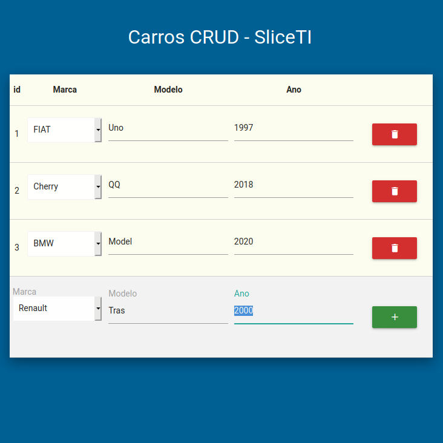

# SliceIT Desafio Estadão

Author: Francisco Matelli Matulovic

### **Description**
CRUD Simples para adicionar carros




## Back-End

Para simplificar a entrega e diminuir o tempo de configuração e facilitar o deploy, optei pelo micro framework PHP LIMONADE para back end, assim deixei de usar modelos, controllers, validate, etc, e serviços como authenticate.

Colocar pasta na raíz do apache ou onde tiver PHP habilitado, criar o banco de dados CARROS e configurar a conexão no arquivo /api/lemon_mysql.php. A instalação verifica o primeiro acesso, cria e popula as tabelas pelo arquivo table_carros_plain_sql_builder_seeder.sql

```
api/lemon_mysql.php Configurar acessos
```

## Front-End

Aplicação nativa em vue.js puro, com axios. Basta abrir o navegador que o mesmo irá se comunicar com a API. A interface é intuitiva, para editar as informações basta selecionar a célula desejada e editar, toda a comunicação é feita em tempo real onkeypress, para deletar e adicionar os itens também.


(Back-end aborted solution: Inicialmente foi-se pensando em utilizar um docker de LUMEN, NGINX + MYSQL para o back-end, https://github.com/franciscof5/laravel-lumen-docker)

(Front-end aborted solution: Nativescript-vue para ter uma mesma aplicação, https://www.nativescript.org/blog/code-sharing-with-nativescript-vue)
